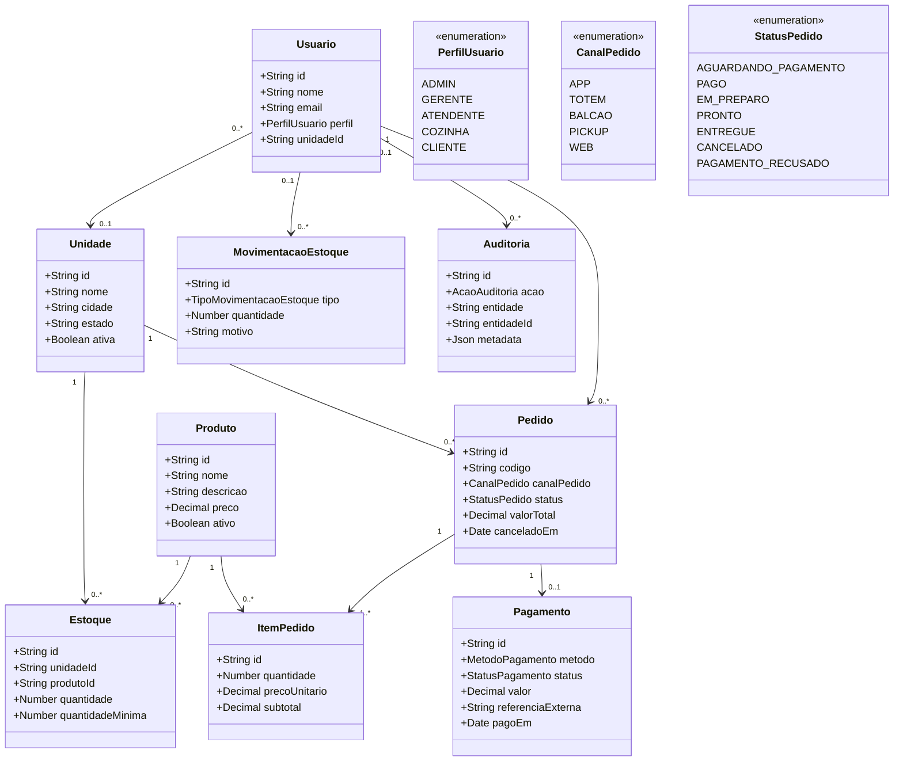

# Diagrama de classes do domínio

```mermaid
classDiagram
  class Usuario {
    +String id
    +String nome
    +String email
    +PerfilUsuario perfil
    +String unidadeId
  }

  class Unidade {
    +String id
    +String nome
    +String cidade
    +String estado
    +Boolean ativa
  }

  class Produto {
    +String id
    +String nome
    +String descricao
    +Decimal preco
    +Boolean ativo
  }

  class Estoque {
    +String id
    +String unidadeId
    +String produtoId
    +Number quantidade
    +Number quantidadeMinima
  }

  class MovimentacaoEstoque {
    +String id
    +TipoMovimentacaoEstoque tipo
    +Number quantidade
    +String motivo
  }

  class Pedido {
    +String id
    +String codigo
    +CanalPedido canalPedido
    +StatusPedido status
    +Decimal valorTotal
    +Date canceladoEm
  }

  class ItemPedido {
    +String id
    +Number quantidade
    +Decimal precoUnitario
    +Decimal subtotal
  }

  class Pagamento {
    +String id
    +MetodoPagamento metodo
    +StatusPagamento status
    +Decimal valor
    +String referenciaExterna
    +Date pagoEm
  }

  class Auditoria {
    +String id
    +AcaoAuditoria acao
    +String entidade
    +String entidadeId
    +Json metadata
  }

  class PerfilUsuario {
    <<enumeration>>
    ADMIN
    GERENTE
    ATENDENTE
    COZINHA
    CLIENTE
  }

  class CanalPedido {
    <<enumeration>>
    APP
    TOTEM
    BALCAO
    PICKUP
    WEB
  }

  class StatusPedido {
    <<enumeration>>
    AGUARDANDO_PAGAMENTO
    PAGO
    EM_PREPARO
    PRONTO
    ENTREGUE
    CANCELADO
    PAGAMENTO_RECUSADO
  }

  Usuario "0..*" --> "0..1" Unidade
  Unidade "1" --> "0..*" Estoque
  Unidade "1" --> "0..*" Pedido
  Produto "1" --> "0..*" Estoque
  Produto "1" --> "0..*" ItemPedido
  Pedido "1" --> "1..*" ItemPedido
  Pedido "1" --> "0..1" Pagamento
  Usuario "1" --> "0..*" Pedido
  Usuario "0..1" --> "0..*" Auditoria
  Usuario "0..1" --> "0..*" MovimentacaoEstoque
```
