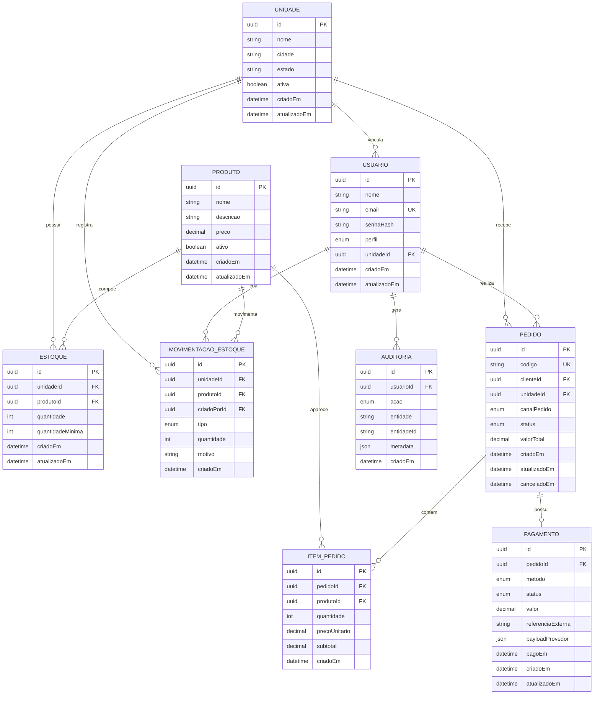

# DER conceitual

```mermaid
erDiagram
  USUARIO {
    uuid id PK
    string nome
    string email UK
    string senhaHash
    enum perfil
    uuid unidadeId FK
    datetime criadoEm
    datetime atualizadoEm
  }

  UNIDADE {
    uuid id PK
    string nome
    string cidade
    string estado
    boolean ativa
    datetime criadoEm
    datetime atualizadoEm
  }

  PRODUTO {
    uuid id PK
    string nome
    string descricao
    decimal preco
    boolean ativo
    datetime criadoEm
    datetime atualizadoEm
  }

  ESTOQUE {
    uuid id PK
    uuid unidadeId FK
    uuid produtoId FK
    int quantidade
    int quantidadeMinima
    datetime criadoEm
    datetime atualizadoEm
  }

  MOVIMENTACAO_ESTOQUE {
    uuid id PK
    uuid unidadeId FK
    uuid produtoId FK
    uuid criadoPorId FK
    enum tipo
    int quantidade
    string motivo
    datetime criadoEm
  }

  PEDIDO {
    uuid id PK
    string codigo UK
    uuid clienteId FK
    uuid unidadeId FK
    enum canalPedido
    enum status
    decimal valorTotal
    datetime criadoEm
    datetime atualizadoEm
    datetime canceladoEm
  }

  ITEM_PEDIDO {
    uuid id PK
    uuid pedidoId FK
    uuid produtoId FK
    int quantidade
    decimal precoUnitario
    decimal subtotal
    datetime criadoEm
  }

  PAGAMENTO {
    uuid id PK
    uuid pedidoId FK
    enum metodo
    enum status
    decimal valor
    string referenciaExterna
    json payloadProvedor
    datetime pagoEm
    datetime criadoEm
    datetime atualizadoEm
  }

  AUDITORIA {
    uuid id PK
    uuid usuarioId FK
    enum acao
    string entidade
    string entidadeId
    json metadata
    datetime criadoEm
  }

  UNIDADE ||--o{ USUARIO : vincula
  UNIDADE ||--o{ ESTOQUE : possui
  UNIDADE ||--o{ MOVIMENTACAO_ESTOQUE : registra
  UNIDADE ||--o{ PEDIDO : recebe
  USUARIO ||--o{ PEDIDO : realiza
  USUARIO ||--o{ AUDITORIA : gera
  USUARIO ||--o{ MOVIMENTACAO_ESTOQUE : cria
  PRODUTO ||--o{ ESTOQUE : compoe
  PRODUTO ||--o{ ITEM_PEDIDO : aparece
  PRODUTO ||--o{ MOVIMENTACAO_ESTOQUE : movimenta
  PEDIDO ||--o{ ITEM_PEDIDO : contem
  PEDIDO ||--o| PAGAMENTO : possui
```
