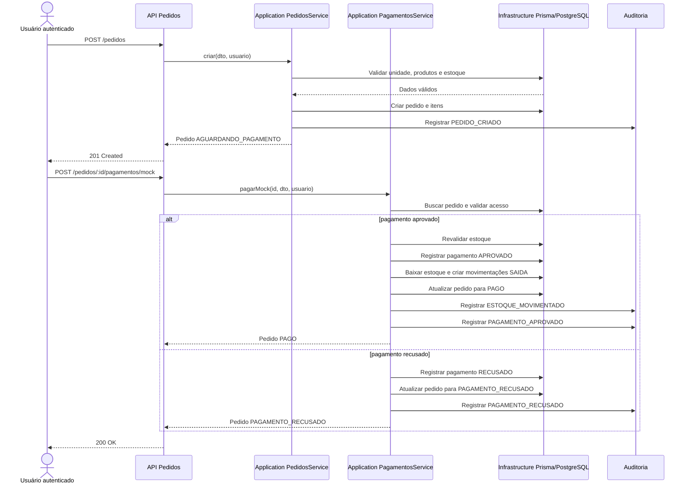

# Fluxo Pedido -> Pagamento mock -> Status -> Auditoria

```mermaid
sequenceDiagram
  actor Usuario as Usuário autenticado
  participant API as API Pedidos
  participant Pedidos as Application PedidosService
  participant Pagamentos as Application PagamentosService
  participant Prisma as Infrastructure Prisma/PostgreSQL
  participant Auditoria as Auditoria

  Usuario->>API: POST /pedidos
  API->>Pedidos: criar(dto, usuario)
  Pedidos->>Prisma: Validar unidade, produtos e estoque
  Prisma-->>Pedidos: Dados válidos
  Pedidos->>Prisma: Criar pedido e itens
  Pedidos->>Auditoria: Registrar PEDIDO_CRIADO
  Pedidos-->>API: Pedido AGUARDANDO_PAGAMENTO
  API-->>Usuario: 201 Created

  Usuario->>API: POST /pedidos/:id/pagamentos/mock
  API->>Pagamentos: pagarMock(id, dto, usuario)
  Pagamentos->>Prisma: Buscar pedido e validar acesso

  alt pagamento aprovado
    Pagamentos->>Prisma: Revalidar estoque
    Pagamentos->>Prisma: Registrar pagamento APROVADO
    Pagamentos->>Prisma: Baixar estoque e criar movimentações SAIDA
    Pagamentos->>Prisma: Atualizar pedido para PAGO
    Pagamentos->>Auditoria: Registrar ESTOQUE_MOVIMENTADO
    Pagamentos->>Auditoria: Registrar PAGAMENTO_APROVADO
    Pagamentos-->>API: Pedido PAGO
  else pagamento recusado
    Pagamentos->>Prisma: Registrar pagamento RECUSADO
    Pagamentos->>Prisma: Atualizar pedido para PAGAMENTO_RECUSADO
    Pagamentos->>Auditoria: Registrar PAGAMENTO_RECUSADO
    Pagamentos-->>API: Pedido PAGAMENTO_RECUSADO
  end

  API-->>Usuario: 200 OK
```
