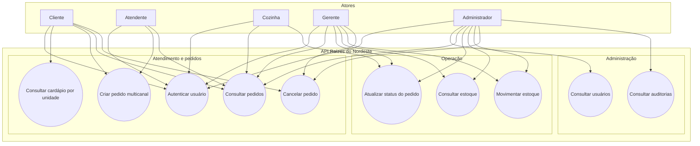
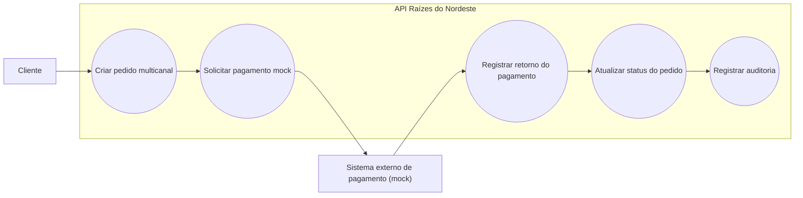

# Diagrama de casos de uso

## Casos de uso principais

```mermaid
flowchart TB
  subgraph Atores["Atores"]
    direction LR
    Cliente["Cliente"]
    Atendente["Atendente"]
    Cozinha["Cozinha"]
    Gerente["Gerente"]
    Admin["Administrador"]
  end

  subgraph Sistema["API Raízes do Nordeste"]
    direction LR

    subgraph Publico["Atendimento e pedidos"]
      direction TB
      Login(("Autenticar usuário"))
      Cardapio(("Consultar cardápio por unidade"))
      CriarPedido(("Criar pedido multicanal"))
      ConsultarPedido(("Consultar pedidos"))
      CancelarPedido(("Cancelar pedido"))
    end

    subgraph Operacao["Operação"]
      direction TB
      AtualizarStatus(("Atualizar status do pedido"))
      ConsultarEstoque(("Consultar estoque"))
      MovimentarEstoque(("Movimentar estoque"))
    end

    subgraph Administracao["Administração"]
      direction TB
      ConsultarUsuarios(("Consultar usuários"))
      ConsultarAuditoria(("Consultar auditorias"))
    end
  end

  Cliente --> Login
  Cliente --> Cardapio
  Cliente --> CriarPedido
  Cliente --> ConsultarPedido
  Cliente --> CancelarPedido

  Atendente --> Login
  Atendente --> CriarPedido
  Atendente --> ConsultarPedido

  Cozinha --> Login
  Cozinha --> ConsultarPedido
  Cozinha --> AtualizarStatus

  Gerente --> Login
  Gerente --> ConsultarPedido
  Gerente --> AtualizarStatus
  Gerente --> ConsultarEstoque
  Gerente --> MovimentarEstoque
  Gerente --> CancelarPedido

  Admin --> Login
  Admin --> ConsultarUsuarios
  Admin --> ConsultarPedido
  Admin --> AtualizarStatus
  Admin --> ConsultarEstoque
  Admin --> MovimentarEstoque
  Admin --> CancelarPedido
  Admin --> ConsultarAuditoria
```

## Fluxo de pagamento mock

```mermaid
flowchart LR
  Cliente["Cliente"]
  Gateway["Sistema externo de pagamento (mock)"]

  subgraph Sistema["API Raízes do Nordeste"]
    CriarPedido(("Criar pedido multicanal"))
    SolicitarPagamento(("Solicitar pagamento mock"))
    RegistrarRetornoPagamento(("Registrar retorno do pagamento"))
    AtualizarStatus(("Atualizar status do pedido"))
    RegistrarAuditoria(("Registrar auditoria"))
  end

  Cliente --> CriarPedido
  CriarPedido --> SolicitarPagamento
  SolicitarPagamento --> Gateway
  Gateway --> RegistrarRetornoPagamento
  RegistrarRetornoPagamento --> AtualizarStatus
  AtualizarStatus --> RegistrarAuditoria
```
